# ogpf
Object Based Interface to GnuPlot from Fortran (ogpf)

## 2D Plots

Simple plot                    | Animation
:-----------------------------:|:------------------------------------:
  | 

## 3D Plots

Surface                        | Contour
:-----------------------------:|:------------------------------------:
 | 


### GnuPlot Interface

	Purpose:   Object Based Interface to GnuPlot from Fortran (ogpf)
	Platform:  Windows XP/Vista/7/10, Linux
			   (It should work on other platforms, e.g Mac see the finalize_plot subroutine in ogpf.f90)
	Language:  Fortran 2003 and 2008
	Requires:  1. Fortran 2003 compiler (e.g gfortran 4.7, IVF 12.1, and later ...)
	              There is only two more features needs Fortran 2008 standard
                  execute_command_line and passing internal function as argument.
			   2. gnuplot 5 and higher (other previous version can be used)
    Author:    Mohammad Rahmani
               Chem Eng Dep., Amirkabir Uni. of Tech
               Tehran, Ir
               url:    aut.ac.ir/m.rahmani
               github: github.com/kookma
               email:  m[dot]rahmani[at]aut[dot]ac[dot]ir
    License:   MIT. Please always give a link to this repo

## PLotting Capabilities
### 2D Plots
* plot(v)
* plot(x,y)
* plot(x,y, linespec)
* plot(x1,y1,ls1, x2,y2,ls2, x3,y3,ls3, x4,y4,ls4)
* plot(x, M)
* semilogx(x,y)
* semilogy(x,y)
* loglog(x,y)
### 3D Plots
* surf(x,y,z)
* surf(x,y,z,lspec)
* surf(x,y,z, palette)
* surf(z, palette)
* contour(x,y,z,palette)
* contour(z,palette)
### Animation
* animation_start(delay)
* animation_show()

### Multiplot
* multiplot(rows, cols)

## Mathematical Utility Functions
* linspace(a,b,n)
* linspace(a,b)
* arange(a,b,dx)
* meshgrid(X,Y, xgv,ygv)
* meshgrid(X,Y, xgv)

## Color palette

Nine different color palettes are available. See [Ann Schnider](https://github.com/aschn/gnuplot-colorbrewer) gnuplot color palettes and [Gnuplotting](https://github.com/Gnuplotting/gnuplot-palettes).
These color palettes can be used with:

> `surf(x,y,z,palette='plt-name')` 

> `contour(x,y,z,palette='plt-name')`

* set1
* set2
* set3
* palette1
* palette2
* paired
* dark2
* accent
* jet

## The ogpf library other features 
There are a plenety commands to customise the plots. This includes:

* Plot annotation (e.g. title, xlabel, ylabel, and zlabel)
* Axes setting (e.g. xrange, yrange, zrange, and grid)
* Line and marker color and style
* Gnuplot options (e.g. fonts, tics format, frame format,... )

### The ogpf options command
The option command is a very powerful command and can be used to customize the gnuplot in many ways. Options can be set by calling the ogpf options.
In every call, it is possible to set several options separated by semicolon or options can be set by several calls. Below shows few samples:

* **Sample 1**

Set the legend (key) at the right bottom of window

`call gp%options('set key bottom right')`

* **Sample 2**

Define a new line style

`call gp%options('set style line 1 lc rgb "blue" lt 1 lw 2 pt 6 ps 1.5')`

* **Sample 3**

Use several options each uses separate command

`call gp%options('set tics')`

`call gp%options('set tics font ",8"') ! font size for tics`


* **Sample 4** 

Set several options at the same time using semicolon as delimiter

`call gp%options('unset tics; unset colorbox') `

# Demo
There is a collection of examples in demo.f90 to show the capabilities of ogpf.

### Easy to use
To use ogpf in your project, add the library file to your fortran project (code)
* ogpf.f90 (the main library)

For details see 'demo.f90'

##### Important Note
To use ogpf on other operating system, you may need to modify the terminal type and fonts
in the section of **Configuration Parameters**.
A Makefile has been provided to build the demo from command line.

### Example codes
This section shows selected example codes from **demo.f90**
* **Example 1**
```fortran
    SUBROUTINE Exmp01
        !...............................................................................
        !Example 1: A very basic example
        !...............................................................................
        TYPE(gpf):: gp
        INTEGER, PARAMETER:: n=17
        Real(wp):: x(n)
        Real(wp):: y(n)
        ! Input data
        x=dble([-8,-7,-6,-5,-4,-3,-2,-1,0,1,2,3,4,5,6,7,8])
        y=dble([66,51,38,27,18,11,6,3,2,3,6,11,18,27,38,51,66])

        ! Annotation: set title, xlabel, ylabel
        CALL gp%title('Example 1. A simple xy plot')
        CALL gp%xlabel('my x axis ...')
        CALL gp%ylabel('my y axis ...')
        Call gp%options('set style data linespoints')
        !Call Plot to draw a vector against a vector of data
        CALL gp%plot(x, y)
    END SUBROUTINE Exmp01
```

Will produce

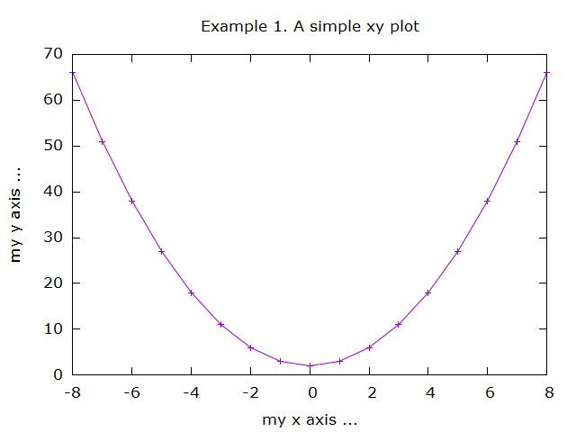


* **Example 04**

Plot several data series at the same time
```fortran
    subroutine exmp04

        type(gpf):: gp
        integer, parameter:: n=50
        integer, parameter:: m=65
        real(wp):: x(n)
        real(wp):: y(n)
        real(wp):: xv(m)
        real(wp):: yv(m)
        real(wp), parameter :: pi=4.d0*atan(1.d0)
        ! Input data
        x=linspace(-pi,pi,n)  !linspace is a utility function from module ogpf
        y=sin(x)

        xv=linspace(0.d0, 2.d0*pi,m)
        yv=cos(2.d0*xv)
        !           This is the maximum number of plot can be drawn at the same time
        !           If you have more data see, you can plot can be used with matrices!
        call gp%title('Example 4. Plot four data sets using gnuplot')
        call gp%options('set key top left; set grid')

        call gp%plot(x,y, 'title "sin(x)"', &
            xv,yv, 'with lp lt 6 title "cos(2x)"', &
            xv, 2.d0*yv, 'title "2cos(2x)" lt 7', &
            xv, 0.5d0*yv, 'title "0.5cos(2x)" with points pt 8')

        ! Another example with keyboard arguments
        call gp%plot(x1=x,y1=y,x2=xv,y2=yv)

    end subroutine exmp04

```
Will produce


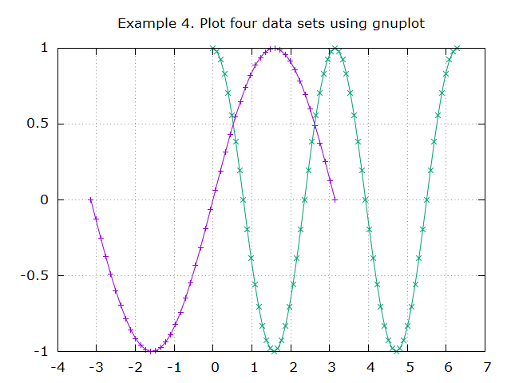


* **Example 05**
```fortran
    SUBROUTINE Exmp05
        !...............................................................................
        ! Example 5: Use line style and legends
        !...............................................................................
        TYPE(gpf):: gplot
        INTEGER, PARAMETER:: n=50
        Real(wp):: x(n)
        Real(wp):: ys(n)
        Real(wp):: yc(n)
        Real(wp):: ysc(n)
        Real(wp), PARAMETER :: pi=4.d0*atan(1.d0)
        ! Input data
        x=linspace(-2.d0*pi,2.d0*pi,n)  !linspace is a utility function from module Utils
        ys=sin(x)
        yc=exp(-0.1d0*x)*cos(x)
        ysc=sin(x/2.d0)*cos(2.d0*x)

        ! Annotation, set title, xlabel, ylabel
        CALL gplot%title('Example 5. A sample with style and legends')
        CALL gplot%xlabel('x, rad')
        CALL gplot%ylabel('y, dimensionless')

        ! Plot to draw three set of data
        CALL gplot%plot(x,ys,'title "sin" with lines lt 5 lc rgb "#0008B0"', &
                        x,yc,'title "cos" with points lt 6 lc rgb "#FF1100"', &
                        x,ysc,'title "sin(x/2)cos(2x)" with lp lt 7 lc rgb "#00AA04"' )

    END SUBROUTINE Exmp05
```
Will produce

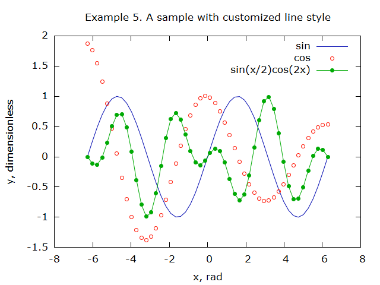

* **Example 06**

```fortran
     subroutine exmp06

        type(gpf):: gplot
        integer, parameter:: n=125

        real(wp):: x(n)
        real(wp):: y(n)

        real(wp), parameter :: pi=4.d0*atan(1.d0)
        ! Input data
        x=linspace(0.d0,pi*2.d0,n)  !linspace is a utility function from module Utils
        y=sin(6.d0*x)*exp(-x)


        ! Annotation, set title, xlabel, ylabel
        call gplot%title('Example 6. A sample shows sin(x) and its zero on the plot')
        call gplot%xlabel('x, rad')
        call gplot%ylabel('sin(x), dimensionless')
        call gplot%options('set grid')

        ! Plot to draw two set of data, a series and a single point
        call gplot%plot(x,y,'title "sin(x)" with lines lt 2 lw 3', &
            [pi],[0.d0],'title "zero" with points pt 7 ps 3 lc rgb "#FF0000"')
    end subroutine exmp06
```

Will produce


* **Example 08**

Plotting matrix against a vector with customized linestyles

```fortran
    subroutine exmp08

        type(gpf):: matplot
        integer, parameter:: n=25, m=6
        integer :: i
        real(wp):: tf
        real(wp):: vo
        real(wp):: g
        real(wp):: t(n)
        real(wp):: y(n,m)

        !Create data
        tf=10.d0
        g=32.d0;
        t=linspace(0.d0,tf,n)
        do i = 1, m
            vo = 25.0d0 * i
            y(:, i) = vo*t-0.5d0*g*t**2
        end do

        !Draw the matrix y againest vector x
        call matplot%title('Example 8. Plotting a Matrix against a vector')
        call matplot%xlabel ('t, sec')
        call matplot%ylabel ('y, feet')
        call matplot%options('set xrange[0:10];set yrange [0:400];')
        call matplot%plot(t, y)

        !Another Matrix plot with legends and line specification
        call matplot%title('Example 8.2: Matrix plot, legends and linespec')
        call matplot%plot(t, 2.0d0*y(:,3:4), &
            lspec='t "vo=100" w lp lt 6 ps 3 lw 2;&
            & t "v=125" w lp lt 7 ps 3 lw 2 lc rgb "#ad6000"')

    end subroutine exmp08

```
Will produce


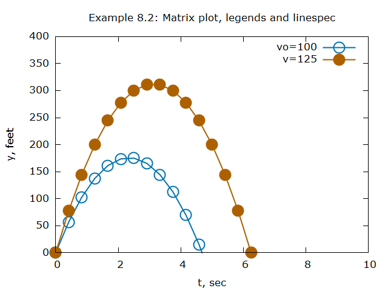


* **Example 9**
Animation with 2D plot

```fortran
   subroutine exmp09

        type(gpf):: gp
        integer, parameter::   n  = 35
        real(wp), parameter :: pi = 4.d0*atan(1.d0)
        real(wp):: x(n)
        real(wp):: y(n), z(n)
        integer :: i


        x=linspace(-pi, pi,n)
        y = 0.0_wp
        z = 0.0_wp
        call gp%animation_start(1) ! start animation, set delay is one second between frames
        call gp%axis([-pi, pi, -1.2_wp, 1.2_wp])
        call gp%options('set grid')
        ! add frames
        do i=1, n, 10
            y(i) = sin(x(i))
            z(i) = cos(x(i))
            ! each plot command adds one frame
            call gp%plot(x(1:i),y(1:i), 'w lines lc "red" lw 2', &
                x(i:i), y(i:i),'w points ps 3 pt 7 lc "red"', &
                x(1:i),z(1:i), 'w lines lc "blue" lw 2', &
                x(i:i), z(i:i), 'w points ps 3 pt 7 lc "blue"' )
        end do
        ! finalize and show frames one by one with delay between them
        ! as set by animation_start
        call gp%animation_show()
   end subroutine exmp09
```
will produce


* **Example 10**

Use options

```fortran
   subroutine exmp10()


        type(gpf):: mp
        real(wp):: x(15)
        real(wp):: y(15)

        !Options is a dynamic length string and can set all kind of gnuplot
        call mp%options('set style line 1 lc rgb "#0060ad" lt 1 lw 2 pt 5 ps 1.5 # --- blue')
        call mp%options('set style line 2 lc rgb "#ad6000" lt 2 lw 2 pt 6 ps 1.5 # --- red')
        call mp%options('set style line 3 lc rgb "#00ad00" lt 2 lw 2 pt 7 ps 1.5 # --- green')
        ! this is a multipart string spanned over several lines
        call mp%options('&
            &set style data linespoints;&
            &set xrange [0.1:100];&
            &set yrange [0.01:10000];&
            &set autoscale')
        call mp%options('set key top left') ! set the key location

        x=linspace(0.1d0,100d0,15);
        y=x**2;
        call mp%title("Example 10. x vs. x^2")
        call mp%plot(x1=x, y1=1.50*y, ls1='t "y=1.5x^2" ls 1', &
            x2=x, y2=2.00*y, ls2='t "y=2.0x^2" ls 2', &
            x3=x, y3=2.50*y, ls3='t "y=2.5x^2" ls 3')
        call mp%reset()
        call mp%title('Reset to initial setting')
        call mp%plot(x,2*y)
    end subroutine exmp10
```
The first output is:

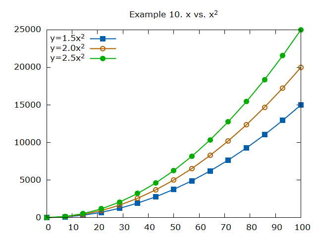

* **Example 11**

```fortran
    subroutine exmp11
        type(gpf):: gp
        integer, parameter :: n=125
        real(wp):: t(n)
        real(wp):: r(n)
        real(wp):: pi=4.d0*atan(1.d0)
        !1. reset gplot
        !!!   CALL gp%reset()
        ! TODOD: There is a problem with reset, persist is off by reset
        !2. set option, and set plot as polar
        call gp%options("&
            &set polar;&
            &set trange [-pi:pi]")

        ! 3. create data
        t=linspace(-pi,pi,n)
        r=sin(3.d0*t)

        !Annotation, set title, xlabel, ylabel
        call gp%title("Example 11: simple polar plot")
        call gp%xlabel("x,...")
        call gp%ylabel("y,...")

        !Call plot method
        call gp%plot(t,r, 'title "sin(3t)"')
        call gp%plot(t, cos(4*t))

    end subroutine exmp11
```
Will produce


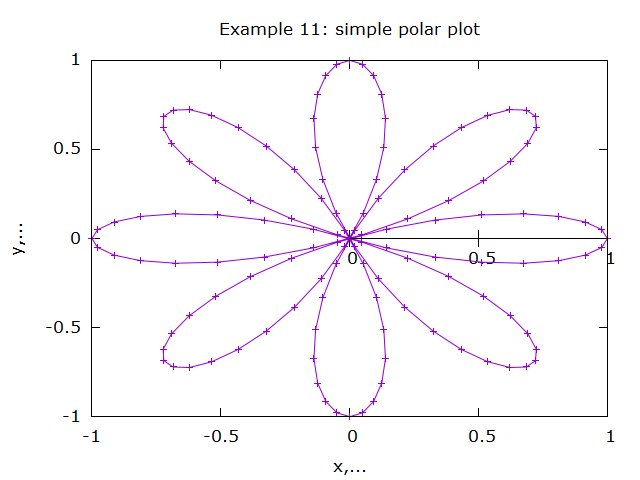

### Logarithmic scale

* **Example 13**

```fortran
    subroutine exmp13
        type(gpf):: gp
        integer, parameter :: n=25
        real(wp):: x(n)
        real(wp):: y(n)


        ! 1. create data
        x=linspace(0.1d0,10.d0,n)
        y=5.d0*x**3+4.d0*x**2+3.d0*x+1.d0

        !Annotation, set title, xlabel, ylabel
        call gp%title("Example 13: A simple matrix plot with semi-log y")
        call gp%ylabel("y,logarithmic scale")
        call gp%xlabel("x, normal scale")

        ! plot a matrix against vector in logarithmic y axis with line specification
        call gp%semilogy(x,reshape([y,10.d0*y],[n,2]), 'with lines lt 8; with points pt 7')

    end subroutine exmp13
```
will produce
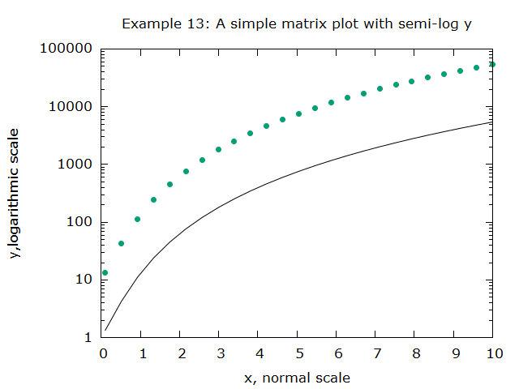


* **Example 14**

```fortran
   subroutine exmp14
        type(gpf):: gp
        integer, parameter :: n=75
        real(wp):: x(n)
        real(wp):: y(n)
        real(wp):: pi=4.d0*atan(1.d0)

        ! 1. create data
        x=exp(linspace(0.d0,2.d0*pi,n))
        y=50.d0+exp( 3.d0* linspace(0.d0,2.d0*pi,n) )

        ! 2. Annotation, set title, xlabel, ylabel
        call gp%title("Example 14: A loglog plot")
        call gp%xlabel("x,logarithmic scale")
        call gp%ylabel("y,logarithmic scale")

        ! 3. Set grid on
        call gp%options('set grid xtics ytics mxtics')

        ! 4. Call plot method
        call gp%loglog(x,y)

    end subroutine exmp14
```
will produce
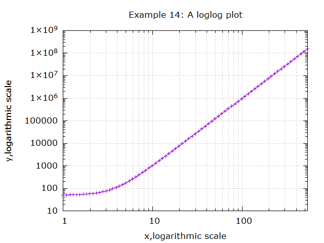


* **Example 16**

Save the script file for future use

```fortran
   subroutine exmp16()
        type(gpf):: gp
        real(wp):: pi=4.d0*atan(1.d0)
        integer, parameter :: n=100
        real(wp) :: x(n)
        real(wp) :: y(n)
        real(wp) :: z(n)

        ! create data
        x = linspace(-pi, 3.0d0*pi)
        y = sin(2.0d0*x)*exp(-x/5.0d0)
        z = cos(2.0d0*x)*exp(-x/5.0d0)

        ! several gnuplot optuons
        call gp%options('set border linewidth 1.5')
        call gp%options('set style line 1 lc rgb "#ad6009" lt 1 lw 2 pt 7 ps 1.5 # --- red like')
        call gp%options('set style line 2 lc rgb "#00ad09" lt 2 lw 2 pt 6 ps 1.5 # --- green like')
        call gp%options('unset key')
        call gp%options('set grid')
        call gp%options('set ytics 1')
        call gp%options('set tics scale 0.75')

        call gp%title("Example 16. Save the script into file for future use")
        call gp%xlabel("x...")
        call gp%ylabel("y...")

        ! save the script into a file
        call gp%filename("Example16.gp")
        call gp%plot(x, y, ls1='with lp ls 1', x2=x, y2=z, ls2='with lp ls 2')

        print*  ! empty line
        print*, 'Plot commands were written in Example16.gp successfully'
        print*, 'Open gnuplot and load this script file to plot the results!'
        print*  ! empty line

    end subroutine exmp16
```
will produce
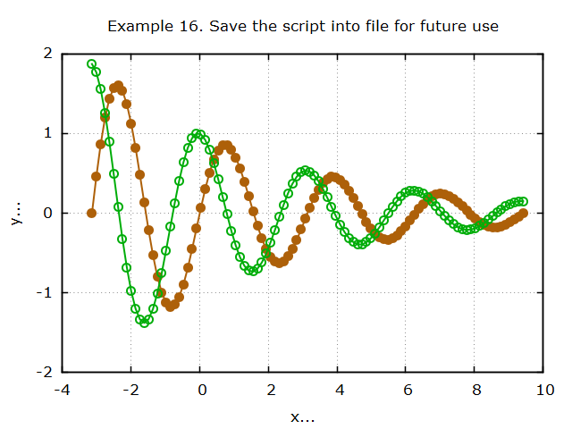

* **Example 17**
Use add_script and run_script to do versatile operation with gnuplot

```fortran
   subroutine exmp17()
        ! Script is used to create multi window plots
        ! Each "set term wxt <number>" creates a new window
        type(gpf):: gp

        call gp%add_script('set term wxt 0 title "My first plot" size 640,480')
        call gp%add_script('set title "Example 17. Multi windows plot using script"')
        call gp%add_script('plot x*x+2*x+1')
        call gp%add_script('set term wxt 1 title "My second plot"')
        call gp%add_script('set ylabel "xsin(x)"')
        call gp%add_script('plot x*sin(x)')

        call gp%run_script()

    end subroutine exmp17
```
will produce
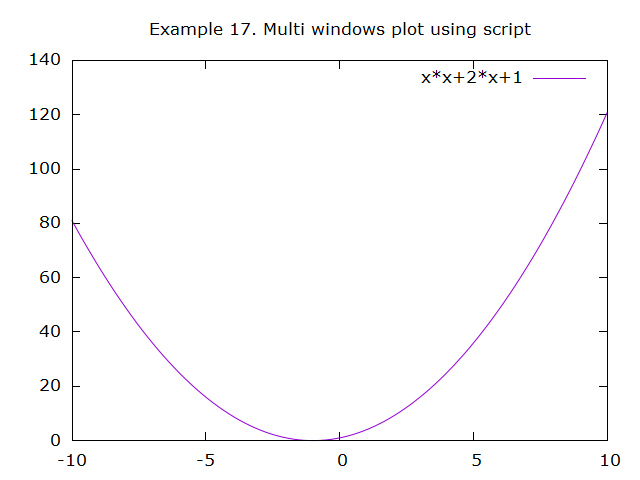
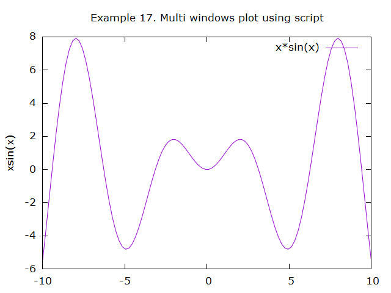


* **Example 18**

```fortran
     subroutine exmp18()
  
        !Use gnuplot script
        !to send a special external script file to gnuplot
        !the file is an external file here is called "simple.plt"
        type(gpf):: gp

        ! add some options and commands
        call gp%title("Example 18. Running an external script file")
        call gp%add_script('load "sample_script.gp" ')

        ! run script
        call gp%run_script()

    end subroutine exmp18

```
Will produce


* **Example 20**

Scatter plot

```fortran
   subroutine exmp20()
        !...............................................................................
        ! Example 20: Making a scatter plot
        !...............................................................................

        type(gpf):: gp
        integer,  parameter :: n=750
        real(wp) :: x(n), y(n), ym(n), noise(n), d(n)
        real(wp) :: a, b

        ! generate data
        a = 00.0_wp
        b = 05.0_wp
        ! 1. generate the model data
        x  = linspace(a,b,n)
        ym = sqrt(x)  ! model data


        ! 2. generate the measured data with noise (ensembles the experimental data)
        call random_number(noise)       ! generate noise in [0, 1]
        d = (b-a)/100.0_wp * (x-a)**2   ! define the deviation function
        d = 2.0_wp*(noise - 0.5_wp) * d ! distribute noise around y=0
        y = ym + d


        call gp%title('Example 20. Scatter plot')
        call gp%xlabel('x,....')
        call gp%options('set key top left')
        call gp%options('set autoscale fix')
        call gp%options('set style line 1 lc rgb "blue" lt 1 lw 2 pt 6 ps 1.5')
        call gp%plot(x, y,  't "exp data" with points pt 6 ps 1.2 lc rgb "#ad2060"', &
            x, ym, 't "mode: y=sqrt(x)" w lines lt 1 lw 3 lc "blue"')

        ! plot only the experimental data
        call gp%title('Example 20. Scatter plot: data with noise')
        call gp%plot(x,y,'w l lc "blue"', x, ym, 'w l lc "dark-red" lw 2')

    end subroutine exmp20
```
Will produce

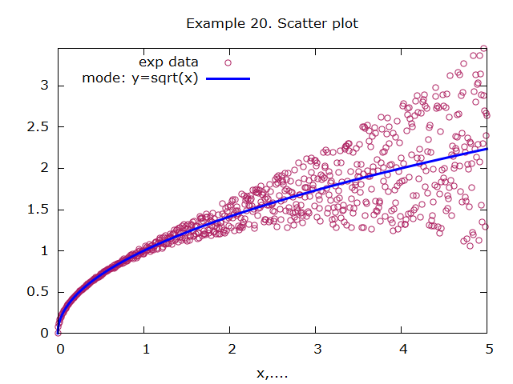
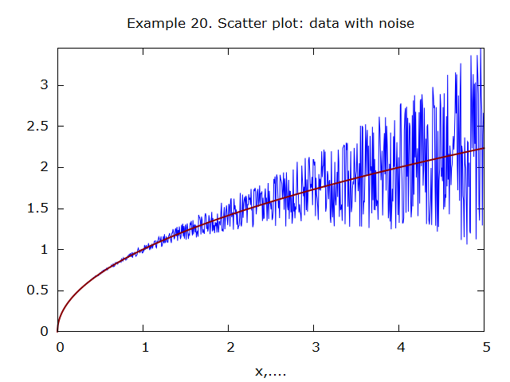


* **Example 21**

Stem plot

```fortran
    subroutine exmp21()
        !...............................................................................
        ! Example 21: Making a stem plot
        !...............................................................................

        type(gpf):: gp
        integer,  parameter :: n=50
        real(wp) :: x(n), y(n)
        real(wp), parameter :: pi=4.0_wp*atan(1.0_wp)

        ! generate data
        x = linspace(0.0_wp, 4.0_wp*pi, n)
        y = exp(-x/4.0)*sin(x)

        call gp%title('Example 21. Stem plot')
        ! making plot
        call gp%plot(x,y, 'with impulses lw 2.5', &
            x, y,  'with points pt 7')

    end subroutine exmp21
```
Will produce

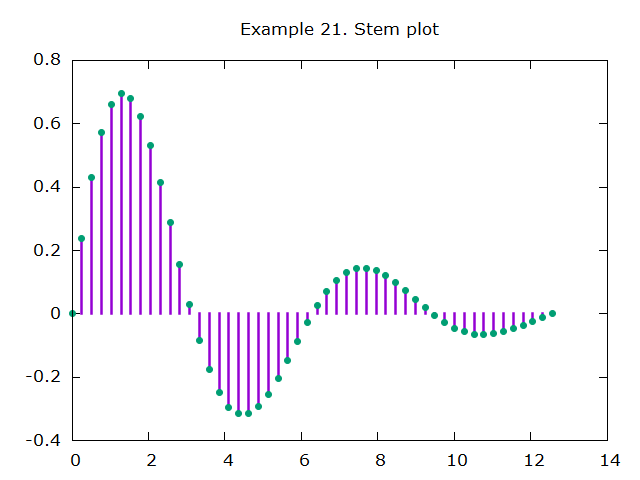


* **Example 22**

Animation with stem plot

```fortran

    subroutine exmp22()
        !...............................................................................
        ! Example 22: Stem plot animation
        !...............................................................................

        type(gpf):: gp
        integer,  parameter :: n=50
        real(wp) :: x(n), y(n)
        real(wp), parameter :: pi=4.0_wp*atan(1.0_wp)
        integer :: i

        ! generate data
        x = linspace(0.0_wp, 4.0_wp*pi, n)
        y = exp(-x/4.0)*sin(x)
        ! important, set the xy axis range
        call gp%axis([0.0_wp, 4.0_wp*pi, -1.0_wp, 1.0_wp])

        ! start animation
        call gp%animation_start(delay=1) ! one second delay between frames
        do i=1,n ! add frames
            ! each plot command adds one frame
            call gp%plot(x(1:i), y(1:i), 'with impulses lw 2', &
                x(1:i), y(1:i),  'with points pt 6')
        end do
        ! finalize and show all frames in ornithological order with pause as
        ! set by animation_start
        call gp%animation_show()

    end subroutine exmp22
```
Will produce

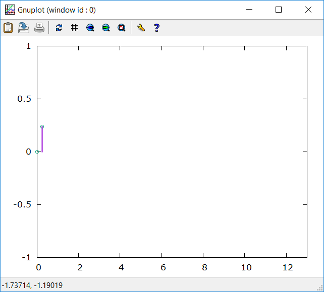


* **Example 25**

Multiplot layout

```fortran
    subroutine exmp25()

        type(gpf):: gp
        integer,  parameter :: n=25
        real(wp), parameter :: pi=4.0_wp*atan(1.0_wp)
        real(wp) :: x(n), y(n,4)
        integer :: i

        x=linspace(-pi, pi, n)
        y(:,1) = sin(x)
        y(:,2) = sin(x)*cos(x)
        y(:,3) = (1-x)*sin(x)
        y(:,4) = (1-x)*cos(x)

        ! general options
        call gp%options('set tics font ",8"')

        call gp%multiplot(2,2)
        do i=1, 4
            call gp%plot(x, y(:,i), 'lt 4 pt 6')
        end do
        ! a new window will be started when all places in the multiplot
        ! layout is occupied. The multiplot window will be closed
        call gp%plot(x,y)
    end subroutine exmp25
```
Will produce

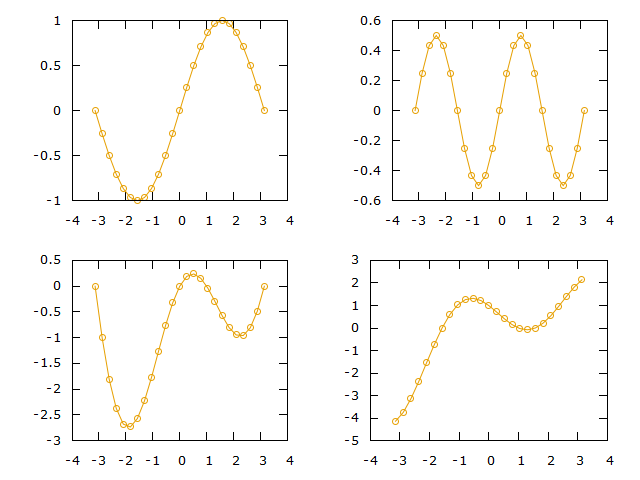
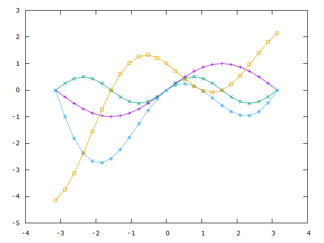

## 3D plots: surf and contour

* **Example 101**

Using different color palettes

```fortran
    subroutine exmp101

        type(gpf):: gp
        real(wp), allocatable:: x(:,:)
        real(wp), allocatable:: y(:,:)
        real(wp), allocatable:: z(:,:)
        real(wp):: a=0.5d0
        real(wp):: b=2.0d0
        real(wp), allocatable :: xgrid(:)
        real(wp), allocatable :: ygrid(:)
        integer:: m
        integer:: n

        ! create 3D data
        m=55 ! number of grid points in y direction
        n=25 ! number of grid points in x direction
        xgrid=linspace(-10.0_wp, 10.0_wp, m)
        ygrid=linspace(0.0_wp, 5.0_wp, n)
        allocate( z(m,n) )

        call meshgrid(x, y, xgrid, ygrid) ! generate the 2D grid data
        z=(x**2/a - y**2/b)

        ! annotation
        call gp%title('Example 101: Simple 3D plot')
        call gp%xlabel('x-axis,...')
        call gp%ylabel('y-axis,...')
        call gp%zlabel('z-axis,...')

        !plot the 3D data
        call gp%surf(x, y, z, lspec='t "default color spec"' ) ! color palette: gnuplot default
        call gp%surf(x, y, z, lspec='t "Ann Schnider set1"', palette='set1' ) ! color palette: set1
        call gp%surf(x, y, z, lspec='t "Matlab Jet"', palette='jet' ) ! color palette: Matlab jet
    end subroutine exmp101

```
Will produce


* **Example 102**

Simple surface plot with color palette


```fortran
   subroutine exmp102()
        type(gpf):: gp

        real(wp), parameter :: pi=4.0_wp*atan(1.0_wp)

        real(wp), allocatable:: x(:,:)
        real(wp), allocatable:: y(:,:)
        real(wp), allocatable:: z(:,:)
        integer:: m
        integer:: n

        ! generate data
        call meshgrid(x, y, linspace(-0.75_wp*pi, 0.75_wp*pi, 35) ) ! xgrid == ygrid
        m=size(x,1)
        n=size(x,2)
        allocate( z(m,n) )

        !z= sin(x) * cos (y)
        where (x**2 + y**2 == 0.0_wp)
            z=1.0_wp
        elsewhere
            z=sin(x**2+y**2)/(x**2+y**2)
        end where


        call gp%title('Example 102: Simple 3D plot with color palette')
        call gp%xlabel('x-axis,...')
        call gp%ylabel('y-axis,...')
        call gp%options('set style data lines')

        !plot the 3D data
        CALL gp%surf(X,Y,Z, palette='jet')

    end subroutine exmp102
```
Will produce


* **Example 103**

A beautiful surface and contour plot

```fortran
    subroutine exmp103()

        type(gpf):: gp
        real(wp), allocatable:: x(:,:)
        real(wp), allocatable:: y(:,:)
        real(wp), allocatable:: z(:,:)
        real(wp):: a=-0.5_wp
        real(wp):: b= 0.5_wp
        real(wp):: pi= 4.0_wp * atan(1.0_wp)
        integer:: m
        integer:: n

        ! create 3D data
        call meshgrid( x, y, linspace(a, b, 55) )
        m=size(x,1)
        n=size(x,2)
        allocate( z(m,n) )
        z= cos(2.0*pi*x) * sin(2.0*pi*y)


        ! annotation
        call gp%title('Example 103: A beautiful surface plot with hidden details')
        call gp%options('set hidden3d')
        call gp%options('unset key')

        !plot the 3D data
        call gp%surf(x, y, z, palette='jet' ) ! color palette: Matlab jet
        ! contour
        call gp%contour(x,y,z, palette='set1')

    end subroutine exmp103
```
Will produce


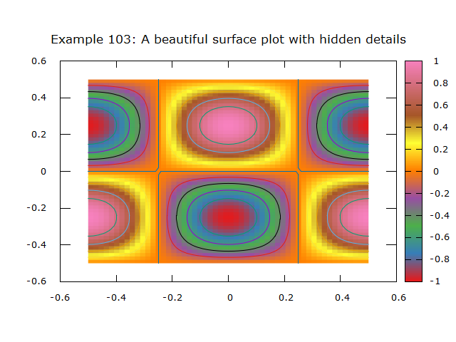


* **Example 104**

Cylindrical mapping


```fortran
    subroutine exmp104()
        type(gpf):: gp
        integer, parameter :: m = 35
        integer, parameter :: n = 15
        real(wp)           :: xv(m), yv(n)
        real(wp), dimension(:,:), allocatable:: x,y,z
        real(wp):: pi= 4.0_wp * atan(1.0_wp)

        xv = linspace(0.0_wp, pi, m)
        yv = linspace(0.0_wp, pi, n)
        call meshgrid(x,y, xv, yv)
        allocate( z(size(x,dim=1), size(x, dim=2)) )
        z = sin(y)


        ! advanced options
        call gp%options('set mapping cylindrical')
        call gp%options('unset tics')
        call gp%options('unset border')
        call gp%options('set view 147,312')
        call gp%options('set hidden3d')

        !
        call gp%title('Example 104. Cylindrical Mapping')
        call gp%surf(x,y,z)

    end subroutine exmp104
```
Will produce


* **Example 105**

Contour plot and surface plot with color palette


```fortran

    subroutine exmp105()
        
        type(gpf):: gp

        real(wp), allocatable:: x(:,:)
        real(wp), allocatable:: y(:,:)
        real(wp), allocatable:: z(:,:)
        integer:: m
        integer:: n
        real(wp), parameter :: pi=4.0_wp*atan(1.0_wp)

        ! create the xyz data
        call meshgrid(x, y, linspace(-2.0_wp,2.0_wp, 65), linspace(-2.0_wp,3.0_wp, 65)  )

        m=size(x,1)
        n=size(x,2)
        allocate( z(m,n) )

        z = x * exp(-x**2 - y**2)

        call gp%options('unset key')
        call gp%options('unset surface')
        call gp%axis([real(wp):: -2, 2, -2, 3])

        !plot the contour
        call gp%title('Example 105: Contour plot')
        call gp%options('unset border; unset tics')
        call gp%surf(x,y,z, palette='accent')
        call gp%contour(x,y,z, palette='jet')

    end subroutine exmp105

```
Will produce


* **Example 106**

Animation with 3D plots


```fortran
   subroutine exmp106()

        type(gpf):: gp
        integer,  parameter :: n=25, m=55
        real(wp) :: xv(m), yv(n), t
        real(wp), allocatable :: x(:,:), y(:,:), z(:,:)
        real(wp), parameter :: pi=4.0_wp*atan(1.0_wp)

        ! generate data
        xv = linspace(0.0_wp, 2.0_wp*pi, m)
        yv = linspace(0.0_wp, 2.0_wp*pi, n)
        call meshgrid(x, y, xv, yv)
        z = sin(x) + cos(y)

        call gp%title('Example 106. Animation of surface plot')
        call gp%axis([0.0_wp, 2.0*pi, 0.0_wp, 2.0*pi])
        call gp%options('unset colorbox')
        call gp%options('set ticslevel 0')
        call gp%axis([0.0_wp, 2.0*pi, 0.0_wp, 2.0*pi, -2.0_wp, 2.0_wp])

        call gp%animation_start(1)
        t=0.050_wp
        do
            ! add frames
            call gp%surf(x, y, sin(t*pi/2.0)*z, palette='jet')
            t=t+0.1_wp
            if (t > 1.0_wp) exit
        end do
        ! show frames in ornithological order with a pause set in
        ! animation_start
        call gp%animation_show()

    end subroutine exmp106

```
Will produce


* **Example 107**

Multiplot layout for 3D plots

```fortran
  subroutine exmp107()
        !...............................................................................
        !Example 107: Multiplot layout in 3D and Contour plot
        !...............................................................................
        type(gpf):: gp

        real(wp), allocatable:: x(:,:)
        real(wp), allocatable:: y(:,:)
        real(wp), allocatable:: z1(:,:)
        real(wp), allocatable:: z2(:,:)
        integer:: m
        integer:: n
        real(wp), parameter :: pi=4.0_wp*atan(1.0_wp)

        ! create the xyz data
        call meshgrid(x, y, linspace(-pi,pi, 60)  )

        m=size(x,1)
        n=size(x,2)
        allocate( z1(m,n) )
        allocate( z2(m,n) )

        z1 = sin(x) + cos(y)
        z2 = sin(x) * cos(y)

        call gp%options('unset key')
        call gp%axis([-pi,pi,-pi,pi])
        call gp%options('unset colorbox')
        call gp%options('set autoscale fix')
        call gp%options('unset tics')

        !plot the contour
        call gp%title('Example 105: Contour plot')
        call gp%multiplot(1,2)
        call gp%surf(x,y,z1)
        call gp%surf(x,y,z2)

        call gp%multiplot(2,1)
        call gp%options('set colorbox')
        call gp%options('set tics')
        call gp%options('set tics font ",8"') ! font size for tics		
        call gp%contour(x,y,z1, palette='jet')
        call gp%contour(x,y,z2, palette='set1')


    end subroutine exmp107
```
Will produce

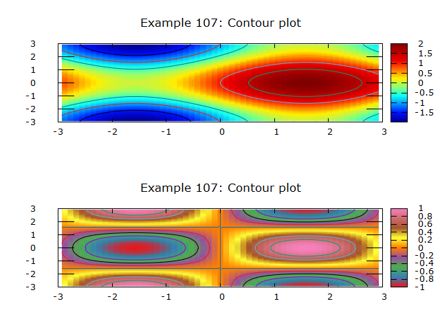


